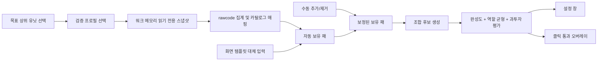

# 설계 및 구현 구조

## 처리 흐름

기본 입력원은 검증된 빌드에 한해 `PROCESS_VM_READ | PROCESS_QUERY_LIMITED_INFORMATION`으로 워크 메모리를 읽습니다. 쓰기·주입·후킹·입력 자동화는 하지 않습니다. 프로필이 없거나 파일 해시/런타임 검증이 실패하면 자동 결과를 적용하지 않고 화면 인식 또는 수동 보정으로 전환할 수 있습니다.

## 모듈

| 영역 | 구현 | 확장점 |
|---|---|---|
| 메모리 인식 | `TmoAssistedMemoryRecognitionService`, `TmoWarcraftDecoder` | 검증된 TMO/워크 빌드 프로필 |
| 대체 인식 | `ScreenRecognitionService` | Windows Graphics Capture, 다중 모니터, OCR 어댑터 |
| 데이터 | `DataCatalog`, JSON | 검수 도구, 서명된 원격 데이터팩 |
| 클리어 통계 | `ClearBuildStats`, `TmoClearRefreshService` | 난이도별 정책, 목표별 심층 분해 |
| 추천 | `RecommendationEngine` | 목표별 가중치, 재료 기회비용, 라운드 상태 |
| 그린블러드 | `GreenBloodAdvisor` | 스턴 코어 연동 수치화, 왜곡 재료 역산 |
| 설정 UI | `MainWindow` | 드래그 영역 선택, 템플릿 생성 마법사 |
| 오버레이 | `OverlayWindow` | 축소 모드, 단축키, 게임 창 추적 |
| 사용자 상태 | `SettingsStore` | 프로필/해상도 프리셋 |

## 인식 전략

### 1순위: 검증된 워크 메모리 프로필

실행 파일 버전과 SHA-256을 모두 확인하고, 서명 고유성·포인터 범위·목록 크기·두 번의 전체 스냅샷 일관성을 통과한 결과만 적용합니다. 앱 데이터와 보조 카드 카탈로그의 positive whitelist에 있는 rawcode만 패로 표시하며, 맵 controller/helper CUnit은 진단에만 남깁니다. 짧은 읽기 race는 마지막 정상 스냅샷을 유지하지만 GameUI=0 등 확정된 세션 종료는 이전 판 패를 지웁니다.

### 2순위: 아이콘 템플릿 매칭

원랜디 유닛 아이콘처럼 위치와 외형이 비교적 고정된 대상에 적합합니다. 슬롯을 먼저 자르면 전체 화면 탐색이 없어져 CPU 사용량과 오탐이 줄어듭니다. 현재 MVP는 16×16 RGB 특징의 유사도를 사용합니다.

실전 강화 순서:

1. 아이콘 테두리를 제외한 내부 ROI만 비교
2. 해상도/스킨별 복수 템플릿
3. HSV 히스토그램 + pHash 1차 검색
4. 상위 후보만 ORB 특징점으로 재검증
5. 3프레임 다수결과 등장/소멸 히스테리시스

### 보조: OCR

OCR은 아이콘 옆 이름, 중첩 수량, 라운드/자원처럼 문자로만 제공되는 정보에 씁니다. 전처리는 2~3배 확대, 명암 대비, 외곽선 제거, 한글 사전 기반 후처리가 필요합니다. `IInventoryRecognizer` 뒤에 OCR 인식기를 합성하면 추천 엔진과 UI를 수정하지 않아도 됩니다.

## 해상도와 DPI 대응

- 캡처 영역은 픽셀이 아니라 화면 너비/높이 대비 0~1 좌표로 저장합니다.
- 슬롯 내부는 16×16로 리샘플링해 1280×720~4K의 크기 차이를 흡수합니다.
- 실전판에서는 게임 창의 클라이언트 영역을 Win32로 추적하고 좌표를 그 안에서 정규화합니다.
- 16:9/16:10/울트라와이드 프리셋을 별도로 두고 자동 캘리브레이션 기준점 2개를 찾는 것이 안정적입니다.
- WPF는 모니터 DPI를 따르지만 화면 캡처는 물리 픽셀 기준이므로 최종판에서는 per-monitor DPI 좌표 변환을 명시해야 합니다.

## 수동 보정

자동 결과와 수동 델타를 분리합니다. 같은 게임 안에서는 화면을 다시 읽어도 사용자가 추가한 보정이 유지되고, TMO 재연결 중에도 수동 보정을 유지합니다. GameUI=0으로 판 종료가 확인되면 다음 판에 섞이지 않도록 함께 초기화합니다. 제거는 현재 보정된 수량이 0인 항목에서 더 내려가지 않도록 차단하여, 다음 자동 스캔까지 숨은 음수 델타가 누적되지 않습니다. 다음 단계에서는 인식 후보 3개를 우클릭 메뉴로 보여주고, 보정 결과를 새 템플릿으로 저장하는 능동학습 흐름을 추가합니다.

## 데이터 모델 핵심

- 유닛: `id`, 표시명, 등급, 역할별 수치, 재료 조합식, 태그
- 루트: 목표 유닛, 필수/선택 유닛, 목표 역할 수치, 조건 태그, 동시 금지 조합
- 인벤토리: 유닛 ID, 수량, 인식 신뢰도, 수동 여부
- 추천: 점수, 보유/부족 유닛, 역할 충족도, 경고, 다음 행동

단순 티어표가 아니라 “이 판에서 만들 수 있는 정도”와 “완성 후 역할 균형”을 분리 계산합니다. 조합식이 채워지면 완제품이 없어도 재료 보유 비율이 완성도에 반영됩니다.

## MVP 이후 구현 순서

1. 검수된 전체 유닛/조합식/역할 수치와 아이콘 데이터팩 구축
2. 게임 창 자동 탐색 및 마우스 드래그 캘리브레이션
3. 복수 템플릿, 프레임 다수결, 신뢰도 UI
4. OCR로 중첩 수량·라운드·목재 등 보조 상태 인식
5. 재료 공유에 따른 기회비용을 포함한 빔서치 조합 탐색
6. 단축키, 트레이, 축소 오버레이, 다중 모니터
7. 서명/해시 검증 데이터 업데이트와 버전 롤백
8. 익명 오탐/추천 피드백 기반 가중치 튜닝(명시적 동의 시)

## 배포 안전성

- 입력 주입, DLL 삽입, 원격 메모리 쓰기는 넣지 않습니다. 프로세스 접근 권한은 읽기와 제한된 정보 조회만 요청합니다.
- 화면 인식 주기를 제한하고 캡처 이미지는 저장하지 않습니다.
- 원격 업데이트는 HTTPS만으로 충분하지 않으므로 SHA-256과 서명 검증을 병행합니다.
- 게임 운영정책상 오버레이 허용 범위는 배포 전 별도 확인이 필요합니다.
