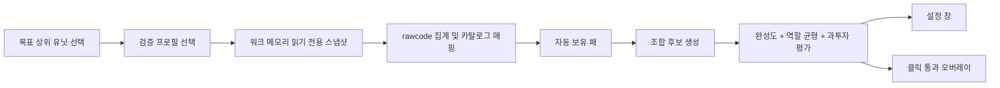

# 설계 및 구현 구조

워크스페이스 기준 아키텍처 문서는 [`../../ARCHITECTURE.md`](../../ARCHITECTURE.md)이며,
메모리 리더 상세 동작은 [`MEMORY_READER.md`](MEMORY_READER.md)에 있습니다.

## 처리 흐름

유일한 인식 경로는 검증된 빌드에 한해 `PROCESS_VM_READ | PROCESS_QUERY_LIMITED_INFORMATION`으로 워크 메모리를 읽는 것입니다. 쓰기·주입·후킹·입력 자동화는 하지 않습니다. 프로필이 없거나 파일 해시/런타임 검증이 실패하면 추천을 중단하고 배너로 원인을 알립니다(fail-closed). 화면 인식이나 수동 보정으로 전환하는 경로는 없습니다.

## 모듈

| 영역 | 구현 | 확장점 |
|---|---|---|
| 메모리 인식 | `WarcraftMemoryRecognitionService`, `WarcraftDecoder` | 검증된 워크 빌드 프로필 |
| 데이터 | `DataCatalog`, JSON | 검수 도구, 서명된 원격 데이터팩 |
| 클리어 통계 | `ClearBuildStats`, `ClearSnapshotRefreshService` | 난이도별 정책, 목표별 심층 분해 |
| 추천 | `RecommendationEngine` | 목표별 가중치, 재료 기회비용, 라운드 상태 |
| 그린블러드 | `GreenBloodAdvisor` | 스턴 코어 연동 수치화, 왜곡 재료 역산 |
| 설정 UI | `MainWindow` | 단축키, 오버레이 이동 |
| 오버레이 | `OverlayWindow` | 축소 모드, 단축키, 게임 창 추적 |
| 사용자 상태 | `SettingsStore` | 프로필/해상도 프리셋 |

## 인식 전략

### 단일 경로: 검증된 워크 메모리 프로필

실행 파일 버전과 SHA-256을 모두 확인하고, 서명 고유성·포인터 범위·목록 크기·두 번의 전체 스냅샷 일관성을 통과한 결과만 적용합니다. 앱 데이터와 보조 카드 카탈로그의 positive whitelist에 있는 rawcode만 패로 표시하며, 맵 controller/helper CUnit은 진단에만 남깁니다. 짧은 읽기 race(TransientReadError)는 마지막 정상 스냅샷을 유지하지만 WC3 미실행이나 로컬 유닛 0개 감지(Waiting) 상태는 이전 판 패를 지웁니다.

화면 캡처 기반 인식 서비스와 수동 보정 UI는 제거되었습니다. 프로필이 없거나 해시 검증이 실패하면 추천을 중단하고 배너로 원인을 알립니다(fail-closed). 대체 입력 경로가 없으므로 인식 소스 선택 콤보, 화면 캡처 영역 좌표, 캡처 주기 설정도 UI와 `AppSettings` 양쪽에서 사라졌습니다.

## 데이터 모델 핵심

- 유닛: `id`, 표시명, 등급, 역할별 수치, 재료 조합식, 태그
- 루트: 목표 유닛, 필수/선택 유닛, 목표 역할 수치, 조건 태그, 동시 금지 조합
- 인벤토리: 유닛 ID, 수량
- 추천: 점수, 보유/부족 유닛, 역할 충족도, 경고, 다음 행동

단순 티어표가 아니라 “이 판에서 만들 수 있는 정도”와 “완성 후 역할 균형”을 분리 계산합니다. 조합식이 채워지면 완제품이 없어도 재료 보유 비율이 완성도에 반영됩니다.

## MVP 이후 구현 순서

1. 검수된 전체 유닛/조합식/역할 수치와 아이콘 데이터팩 구축
2. 재료 공유에 따른 기회비용을 포함한 빔서치 조합 탐색
3. 단축키, 트레이, 축소 오버레이, 다중 모니터
4. 서명/해시 검증 데이터 업데이트와 버전 롤백
5. 익명 오탐/추천 피드백 기반 가중치 튜닝(명시적 동의 시)

## 배포 안전성

- 입력 주입, DLL 삽입, 원격 메모리 쓰기는 넣지 않습니다. 프로세스 접근 권한은 읽기와 제한된 정보 조회만 요청합니다.
- 원격 업데이트는 HTTPS만으로 충분하지 않으므로 SHA-256과 서명 검증을 병행합니다.
- 게임 운영정책상 오버레이 허용 범위는 배포 전 별도 확인이 필요합니다.
